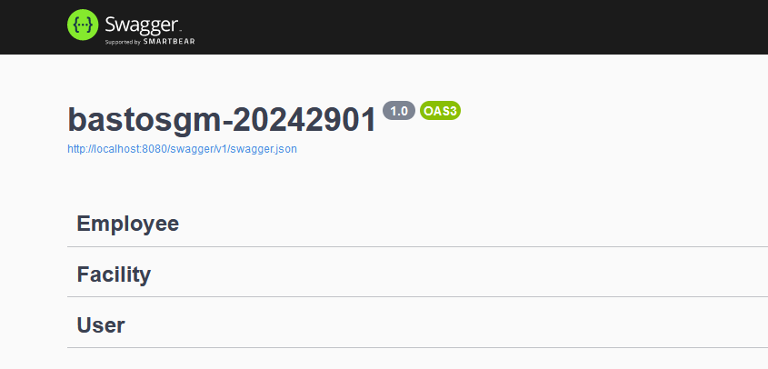

# Igovit (needs update)

> Employees management system

This is a system for registering, updating and viewing of information about available employees and units, with user registration and authentication. Aims to be **simple** and **to the point**, **without overengineering** and **from the scratch**, as a initial MVP, which may later receive other features and improvements.

## History

- 1.0.0
  - Initial Project

## Instalation

...

## First steps

Once the containers are up, first access the [documentation](http://localhost:8080/swagger/index.html) to get access to the possible endpoints and other details.

To start testing, you can use the tool of your choice, such as CLI `curl`, or another GLI-based tool like [Postman](https://www.postman.com/downloads), [Insomnia](https://insomnia.rest/download) or [Thunder Client](https://www.thunderclient.com/) (VSCode extension).

It is important to point out that:

- Every identification `id` was considered to be in the uuid format, which cannot be changed
- There can only be one `Employee` linked to one `User`, and this is done via the `JWT token`, so it is not possible to create more than one `Employee` using the same access token
- The addition of any extra property in the request bodies will pass at first, but will be disregarded when inserting into the database

In addiction:

- The whole implementation here lack of improvements and exception handling, which would be left for another urgent version
- I apologize for any misinterpretation of the challenge, and I am available for launch improvements
- Thank you for the challenge and your confidence in me

## Meta

Gustavo Bastos - [Linkedin](https://linkedin.com/in/bastosgm) - bastosgm@outlook.com

Distributed under license GPLv3. See `License` for more information.

[https://github.com/bastosgm/bastosgm-20240129](https://github.com/bastosgm/bastosgm-20240129)
